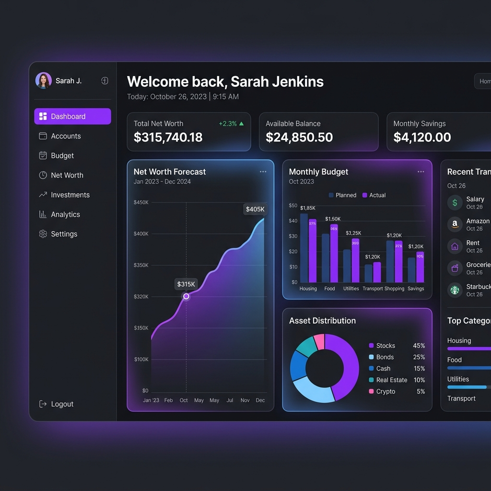

# Finance Overview 🚀

[](LICENSE)


**The Personal Financial Cockpit** — A realistic, long-term financial forecasting tool designed to give you clarity on your future net worth.



## Overview

This project is a personal finance dashboard that simulates your financial future over 30+ years. It accounts for assets, recurring cash flows (income/expenses), one-time events, and pensions, all while factoring in the impact of inflation on your purchasing power.

## ✨ Key Features

- **Long-term Forecast**: 30-year simulation of your net worth.
- **Inflation Monitor**: Visualizes the gap between nominal value and real purchasing power.
- **Dynamic Dashboards**: Customizable chart layouts, colors, and widget sizes.
- **Multi-Language Support**: Fully translated into **German, English, French, Spanish, and Italian**.
- **Collapsible Tables**: Grouped yearly views with Alpine.js-powered interactivity.
- **Privacy First**: Self-hosted, your data stays in your personal database.

## 🛠 Tech Stack

- **Backend**: Django 6.0.2
- **Frontend**: Bootstrap 5, Alpine.js, Chart.js
- **Database**: SQLite (default) / PostgreSQL compatible
- **Deployment**: Docker & Docker Compose

## 🚀 Getting Started

### Prerequisites

- Python 3.10+
- (Optional) Docker & Docker Compose

### Local Installation

1. **Clone the repository**:
   ```bash
   git clone https://github.com/bzaiser/Open-finanz-overview.git
   cd Open-finanz-overview
   ```

2. **Set up virtual environment**:
   ```bash
   python -m venv venv
   source venv/bin/activate  # Linux/macOS
   # venv\Scripts\activate  # Windows
   ```

3. **Install dependencies**:
   ```bash
   pip install -r requirements.txt
   ```

4. **Set up environment variables**:
   ```bash
   cp .env.example .env
   # Edit .env and add your SECRET_KEY and (optional) GEMINI_API_KEY
   ```

5. **Initialize database & Demo data**:
   ```bash
   python3 manage.py migrate
   python3 manage.py seed_demo_data
   ```
   *This creates a user **demo** with password **demo** pre-filled with realistic financial data.*

6. **Run server**:
   ```bash
   python3 manage.py runserver
   ```
   Access at `http://127.0.0.1:8000` (Login: `demo` / `demo`).

### 🤖 Smart Import (New Feature)
This project now includes an **AI-powered bank statement import**. Use an Excel export from your bank, and the Google Gemini AI will automatically categorize transactions and detect recurring patterns (subscriptions, salaries) for easy database entry.

### Docker Deployment (Recommended)

1. **Build and start**:
   ```bash
   docker-compose -f docker/docker-compose.yml up -d
   ```
2. **Access**:
   The dashboard is available at `http://localhost:8000`.

## 🔒 Security

- Authenticated users are granted `is_staff` access automatically to manage their own data via the Admin panel.
- Shared session cookies between Frontend and Admin for a seamless experience.

## 📄 License

This project is licensed under the MIT License. See the [LICENSE](LICENSE) file for details.

---
*Created with ❤️ by Bernd Zaiser*
